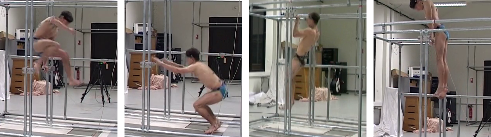

# The LAAS Parkour dataset



## Introduction

The *LAAS Parkour dataset* contains 28 RGB videos capturing human subjects performing four typical parkour techniques: *safety-vault*, *kong vault*, *pull-up* and *muscle-up*.
These are highly dynamic motions with rich contact interactions with the environment.
The dataset is provided with the *ground truth 3D positions* of 16 pre-defined human joints, together with the *contact forces* at the human subjects' hand and foot joints exerted by the environment.

This dataset is based on the [LAAS Parkour MoCap database](https://gepettoweb.laas.fr/parkour/) which is originally created for biomechanics research. 
The major differences between the two datasets are summarized in the following table:

| Difference        | The LAAS Parkour MoCap database                                                                                            | The LAAS Parkour dataset (this repo)                                  |
| :---------------: | :-------------------------------                                                                                           | :------------------------                                             |
| Short name        | Parkour-MoCap                                                                                                              | Parkour-dataset                                                       |
| Size              | 65 videos                                                                                                                  | 28 trimmed videos                                                            |
| Ground truth data | Raw sequence data captured with a Vicon MoCap system and force sensors (MoCap marker positions, force platform records, etc.) | 3D human joint positions & 6D contact forces computed from MoCap data |


## Quick setup

### Dependencies

* Python 2
* [Pinocchio](https://stack-of-tasks.github.io/pinocchio/) with Python binding (for computing rigid-body dynamics)
* [Gepetto-viewer Corba](https://github.com/Gepetto/gepetto-viewer-corba) (optional, for visualization)
* [ffmpeg](https://ffmpeg.org/) (optional, for converting video to images)
* [BTK](http://biomechanical-toolkit.github.io/) Python (optional, for reproducing this dataset)

### Installation

```terminal
git clone https://github.com/zongmianli/Parkour-dataset
```
In the following parts, we will use the symbol `${parkour_dataset}` to denote the local path to the dataset repository `Parkour-dataset/`.

### (Optional) Extracting frames from video
In terminal, run the following script to convert all videos in the dataset to frames. 
The output images are saved in the folder `${parkour_dataset}/frames/`.
```terminal
cd ${parkour_dataset}
source lib/video_to_frames.sh ${parkour_dataset}
```
As an alternative, we provide a set of pre-extracted frames which can be downloaded from [here](https://www.di.ens.fr/willow/research/motionforcesfromvideo/Parkour-dataset/Parkour-dataset-frames.zip) (1.38 GB).

## Computing motion and force estimation errors

This dataset is provided with a Python library for evaluating the performance of 3D motion and/or force estimators.

To use the library, append `${parkour_dataset}/lib/` to `sys.path` and create a new instance of the class `ParkourEvaluator`.
For example:
```python
from parkour_evaluator import ParkourEvaluator

gt_dir = "${parkour_dataset}/gt_motion_forces" # path to gt_motion_forces/
video_name = "kv01_PKFC" # video name without extension
evaluator = ParkourEvaluator(gt_dir, video_name)
```

### Computing 3D motion errors

The following code computes the mean per joint position error (MPJPE) of a set of input joint 3D positions (`joint_3d_positions_pred`) with respect to the ground truth after rigid alignment (by solving an orthogonal Procrustes problem):
```python
evaluator.Evaluate3DPoses(joint_3d_positions_pred)
print("MPJPE (mm): {0:.2f}".format(evaluator.mpjpe['procrustes']))
```
The input data `joint_3d_positions_pred` must be a 3D array of size `(num_frames, 16, 3)`, where `num_frames` is the number of video frames and 16 is the number of considered joints.
The second dimension of `joint_3d_positions_pred` is supported to be sorted in the same order shown in the following table:

| joint id | joint name     |
| :------: | :----------    |
|        0 | left hip       |
|        1 | left knee      |
|        2 | left ankle     |
|        3 | left toes      |
|        4 | right hip      |
|        5 | right knee     |
|        6 | right ankle    |
|        7 | right toes     |
|        8 | left shoulder  |
|        9 | left elbow     |
|       10 | left wrist     |
|       11 | left fingers   |
|       12 | right shoulder |
|       13 | right elbow    |
|       14 | right wrist    |
|       15 | right fingers  |

### Computing contact force errors

This sample code shows how to evaluate a set of estimated 6D contact forces (`contact_forces_pred`) with respect to the ground truth.
```python
evaluator.EvaluateContactForces(contact_forces_pred)
print("Mean lin. force errors (Newton): {0}".format(
    evaluator.mean_linear_force_errors))
print("Mean torque errors (Newton-metre): {0}".format(
    evaluator.mean_torque_errors))
```
Similarly, the data array `contact_forces_pred` must be of size `(num_frames, 4, 6)`, with the second dimension indicating the four types of contact forces considered in this dataset (see the table below).

| force id | force description                   |
| :------: | :-----------                        |
|        0 | ground reaction force at left foot  |
|        1 | ground reaction force at right foot |
|        2 | object contact force at left hand   |
|        3 | object contact force at right hand  |

## (Optional) Reproducing the dataset from MoCap data

As mentioned above, we make the distinction between our smaller LAAS Parkour dataset (aka *Parkour-dataset*) and the original LAAS Parkour MoCap database (aka *Parkour-Mocap*).
This section is aimed at reproducing the *Parkour dataset* from the original *Parkour-MoCap* data.

### Download Parkour-MoCap data

First of all, download the original motion data and RGB videos (visit the [LAAS project page](https://gepettoweb.laas.fr/parkour/)).
Decompress the downloaded packages into a new local repository named `Parkour-MoCap/`.
This will create two subfolders `c3d/` and `videos/` with motion files and RGB videos, respectively.
Similar to `${parkour_dataset}`, we use the symbol `${parkour_mocap}` to denote the path to the `Parkour-MoCap/` folder.

### Extracting frames from Parkour-MoCap video

Run the following script in terminal:
```terminal
cd ${parkour_dataset}
source lib/video_to_frames.sh ${parkour_mocap}
```
The output images are saved under `${parkour_mocap}/frames/`.

### Computing ground truth 3D motion and contact forces
To do the job, update line 7 and line 8 in `lib/traverse_dataset.sh` with correct paths and then run
```terminal
source lib/traverse_dataset.sh extract_motion_forces
```
This command saves the frames for the *Parkour dataset*, computes 3D person joint positions from raw marker positions and local contact forces from the original analog channels in C3D files.
The output images are saved to `${parkour_dataset}/frames/`.
The ground-truth 3D motion and contact forces are saved to `${parkour_dataset}/gt_motion_forces/`.

Note that the length of image sequences in `${parkour_dataset}/frames` are shorter than the original ones saved in `${parkour_mocap}/frames`.
For example, the sequence *kv01_PKFC* which originally has 127 frames is shortened to 34 frames.
This is because for each Parkour-MoCap video, only a short period of time (34 frames in the case of *kv01_PKFC*) was recorded with MoCap and force sensors.
In other words, the lengths of the original RGB videos are longer than the MoCap/force sequences saved in `*.c3d`.
For this reason, we chose to align each MoCap/force sequence with the corresponding video in time, remove the video frames with missing Mocap data (127-34=93 frames in the case of *kv01_PKFC*) and rename the remaining video frames with new indices.

## Citation

If you are using this dataset, please consider citing:
```bibtex
@InProceedings{li2019motionforcesfromvideo,
  author={Zongmian Li and Jiri Sedlar and Justin Carpentier and Ivan Laptev and Nicolas Mansard and Josef Sivic},
  title={Estimating 3D Motion and Forces of Person-Object Interactions from Monocular Video},
  booktitle={Computer Vision and Pattern Recognition (CVPR)},
  year={2019}
}

@article{maldonado2017angular,
  title={Angular momentum regulation strategies for highly dynamic landing in Parkour},
  author={Maldonado, Galo and Bailly, Fran{\c{c}}ois and Sou{\`e}res, Philippe and Watier, Bruno},
  journal={Computer Methods in Biomechanics and Biomedical Engineering},
  volume={20},
  number={S1},
  pages={123--124},
  year={2017},
  publisher={Taylor \& Francis Journals}
}

@phdthesis{maldonado2017analysis,
  title={Analysis and generation of highly dynamic motions of anthropomorphic systems : application to parkour},
  author={Maldonado, Galo},
  year={2017},
  school={Universit{\'e} Paul Sabatier - Toulouse III}
}
```
